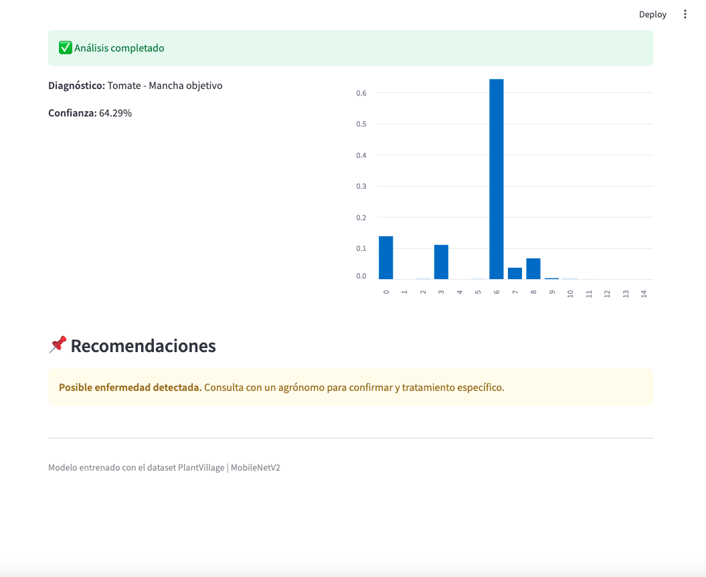
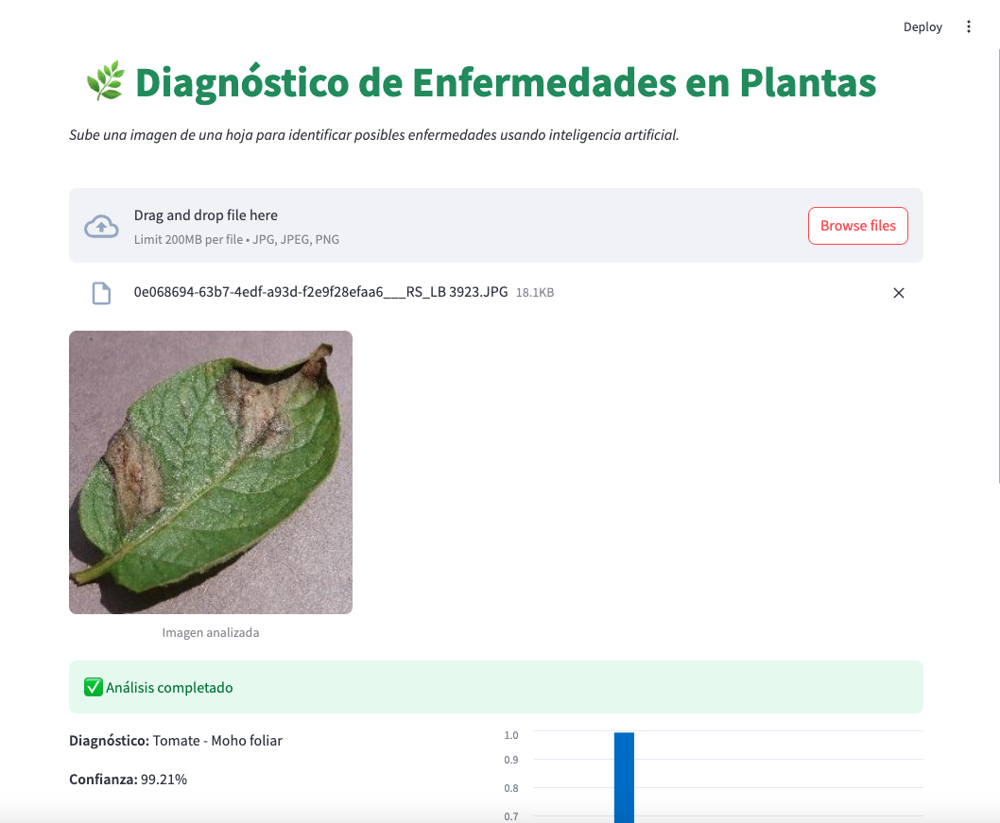

🌿 Diagnóstico de Enfermedades en Plantas con IA
Este proyecto utiliza inteligencia artificial para identificar enfermedades en plantas a partir de imágenes de hojas. Está construido con Streamlit , TensorFlow/Keras y un modelo entrenado previamente sobre el dataset PlantVillage .

🧠 ¿Qué hace la aplicación?
Permite subir una imagen de una hoja (formato JPG, JPEG o PNG).
Detecta posibles enfermedades usando un modelo de clasificación por visión artificial.
Muestra el diagnóstico junto con el nivel de confianza del modelo.
Ofrece recomendaciones básicas según el resultado obtenido.
📦 Requisitos
Asegúrate de tener instaladas las siguientes librerías:

bash

1
pip install streamlit pillow tensorflow numpy matplotlib seaborn
También necesitas tener un modelo guardado como plantvillage_mobilenet.h5 en la misma carpeta del script.

📁 Estructura del Proyecto

  

diagnostico_plantas/
│
├── deepstream.py           # Código principal de la aplicación
├── plantvillage_mobilenet.h5  # Modelo preentrenado
└── README.md                  # Este archivo
🚀 Cómo ejecutar la aplicación
Asegúrate de tener Python 3.x instalado.
Instala las dependencias mencionadas arriba.
Coloca el modelo de IA (plantvillage_mobilenet.h5) en la misma carpeta.
Ejecuta la aplicación desde la terminal:
bash

  

1
streamlit run deepstream.py
Abre el navegador y accede a la interfaz web que se muestra automáticamente.
📝 Notas importantes
El modelo usado es una versión optimizada basada en MobileNetV2, entrenada sobre el conjunto de datos PlantVillage.
La aplicación no sustituye un diagnóstico profesional agronómico, solo sirve como herramienta de apoyo inicial.
Puedes mejorar la interfaz o integrar más funcionalidades como:
Historial de análisis
Exportar resultados
Soporte multilenguaje
🧪 Clases soportadas
El modelo puede identificar enfermedades en distintos cultivos, incluyendo:

Tomate, papa, maíz, fresa, manzana, cereza, melocotón, uva, arándano y naranjo.
Para ver todas las clases, consulta el diccionario CLASS_NAMES dentro del código.
🛡️ Licencia
Este proyecto está bajo la licencia MIT. Puedes usarlo, modificarlo y distribuirlo libremente.

👥 Contacto
¿Tienes dudas o sugerencias?
📧 rosana8longares@gmail.com
🔗 LinkedIn https://www.linkedin.com/in/rosanalongares/
🔗 GitHub https://github.com/RosanaNicklas/PlantsVillage

¡Esperamos que este proyecto te sea útil para el diagnóstico temprano de enfermedades en plantas mediante inteligencia artificial!

🌱 ¡Cultiva salud, usa tecnología!